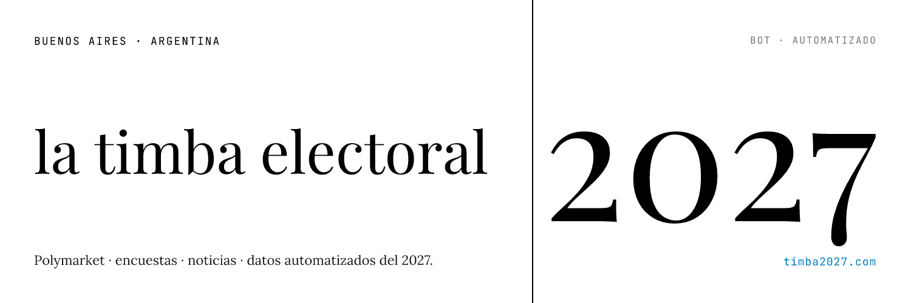

# Timba

> Bot autónomo de X que cruza **Polymarket + encuestas locales + noticias** para reportar el ciclo electoral argentino 2026-2027.

[](./LICENSE)
[](https://nodejs.org/)
[](https://nextjs.org/)
[](./CONTRIBUTING.md)

<p align="center">
  
</p>

🤖 **En vivo:** [@Timba2027](https://x.com/Timba2027) — 🌐 **Sitio:** [timba2027.com](https://timba2027.com)

---

## Qué hace

Timba publica **cards visuales** screenshot-friendly sobre política argentina, sin opinión y con citas a fuente. Detecta:

- 📈 **Movimientos en Polymarket** — cuando un mercado relevante (presidenciales, legislativas) se mueve > 2% en una ventana corta.
- 🗳️ **Nuevas encuestas** — extraídas vía LLM-vision de las cuentas X de las encuestadoras (Zuban-Córdoba, Atlas Intel, Trespuntozero, etc.).
- 📰 **Noticias** — feeds RSS de medios mainstream argentinos con scoring de impacto.
- 📅 **Resumen semanal** — thread automatizado los domingos a las 21:00 ART.

Todo pasa por una **review queue** antes de publicarse, con kill-switch global y modos `shadow` / `soft` / `full` para escalar la autonomía gradualmente.

## Por qué

La política argentina es zona caliente: la información circula rápido y se distorsiona más rápido. Timba existe para tener una capa **factual, citable y reproducible** sobre el ciclo electoral — un robot reporter que cruza fuentes que rara vez se ven juntas (mercados de predicción, encuestadoras locales, prensa) y deja un archivo navegable de todo lo publicado.

No predice, no opina, no pone plata: reporta lo que dicen los datos y te muestra el link a la fuente.

## Stack

- **Runtime:** Node 20+, TypeScript, pnpm
- **Worker:** `node-cron` + orchestrator propio
- **Web:** Next 15 (App Router) + React 19
- **DB:** Postgres 16 + Drizzle ORM
- **Cards:** [Satori](https://github.com/vercel/satori) + Resvg (SVG → PNG)
- **LLM:** Claude (CLI o SDK, intercambiable vía `LLM_TRANSPORT`)
- **Publish:** X API v2 (OAuth 1.0a para escritura)
- **Diseño:** inspirado en WIRED — ver [`DESIGN.md`](./DESIGN.md)

## Cómo funciona

```
┌─────────────────────┐
│  Sources (cron)     │   Polymarket • RSS news • X (polls)
└──────────┬──────────┘
           ▼
┌─────────────────────┐
│  Trigger engine     │   detecta eventos relevantes
└──────────┬──────────┘
           ▼
┌─────────────────────┐
│  LLM caption + card │   genera copy + render PNG
└──────────┬──────────┘
           ▼
┌─────────────────────┐
│  Drafts queue       │   status=draft → review humano
└──────────┬──────────┘
           ▼
┌─────────────────────┐
│  X Publisher        │   shadow / soft / full + kill switch
└─────────────────────┘
```

El sitio público (Next) sirve **archivo navegable** + páginas por candidato/encuestadora, y el admin (basic auth) sirve **review queue** + settings.

## Quick start

Requisitos: **Node 20+**, **pnpm**, **Docker**, [Claude CLI](https://docs.anthropic.com/claude-code) autenticado, **X API bearer token** (opcional para arrancar).

```bash
git clone https://github.com/ezeqmina/ar-elections-2027.git
cd ar-elections-2027
cp .env.example .env
# Editar .env (DATABASE_URL ya tiene un default usable + X_API_* si vas a publicar)

docker compose up -d                          # postgres
pnpm install
pnpm db:migrate
pnpm tsx scripts/seed-pollsters.ts            # carga encuestadoras
pnpm worker                                    # arranca cron en una terminal
pnpm web                                       # arranca Next en otra
```

Sitio: <http://localhost:3000> · Admin: <http://localhost:3000/admin> (basic auth via `ADMIN_BASIC_AUTH_USER/PASS`).

**Tip:** dejá `PUBLISH_MODE=shadow` y `KILL_SWITCH=true` mientras desarrollás — el worker genera drafts sin tocar X.

## Comandos útiles

```bash
pnpm dev              # worker en watch mode
pnpm worker           # worker one-shot
pnpm web              # next dev
pnpm web:build        # build prod
pnpm test             # vitest
pnpm typecheck        # tsc --noEmit
pnpm db:generate      # nueva migration desde el schema
pnpm db:migrate       # aplica migraciones
pnpm db:studio        # drizzle studio

# Admin CLI
pnpm tsx scripts/admin.ts list
pnpm tsx scripts/admin.ts approve <id>
pnpm tsx scripts/admin.ts publish-now <id>
pnpm tsx scripts/admin.ts mode soft
pnpm tsx scripts/admin.ts kill-switch on
```

## Modos de publicación

| Modo | Qué hace | Cuándo usarlo |
|------|----------|---------------|
| `shadow` (default) | No publica nada. Drafts se acumulan en cola. | Desarrollo, fine-tuning de prompts |
| `soft` | Publica 9-22 ARG, cap 3/día, delay 60s post-approve | Lanzamiento gradual |
| `full` | 24/7, cap 6/día, quiet hours 1-7am ARG | Autónomo |

**Kill switch global** (`KILL_SWITCH=true`) bloquea TODA publicación, en cualquier modo.

## Estructura

```
src/
  workers/        orchestrator + cron
  sources/        polymarket, polls, news ingestion
  trigger/        detección de eventos publicables
  llm/            wrapper sobre Claude (CLI o SDK)
  render/         Satori → PNG (cards)
  publish/        X API client + scheduler
  db/             schema Drizzle + queries
  lib/            env, logger, utilidades

app/              Next 15 — sitio público + admin
docs/             design doc + planes históricos
scripts/          tareas operativas (admin CLI, seeds, smoke tests)
tests/            vitest
```

## Roadmap

- [ ] Tests E2E del pipeline completo (ingesta → draft → publish dry-run)
- [ ] Soporte para más encuestadoras (issue tracker abierto a sugerencias)
- [ ] Dashboard de métricas pre/post publicación (engagement, alcance)
- [ ] Re-scoring de noticias usando engagement histórico
- [ ] Modo "evento en vivo" (debates, jornadas electorales)

## Contribuir

PRs bienvenidas. Antes de empezar, leé [`CONTRIBUTING.md`](./CONTRIBUTING.md) — explica cómo levantar el entorno, convenciones de commits, y cómo agregar una nueva fuente (encuestadora, feed RSS, mercado).

Bugs y feature requests: abrí un [issue](../../issues/new/choose).

Security: ver [`SECURITY.md`](./SECURITY.md).

## Licencia

[MIT](./LICENSE) — usalo, forkealo, sacale guita si podés. Atribución agradecida pero no obligatoria.

## Créditos

Construido por **[Ezequiel Mina](https://github.com/ezeqmina)**.

Diseño visual inspirado en WIRED (ver [`DESIGN.md`](./DESIGN.md)). Datos de [Polymarket](https://polymarket.com/), encuestadoras públicas argentinas y feeds RSS de medios locales.
